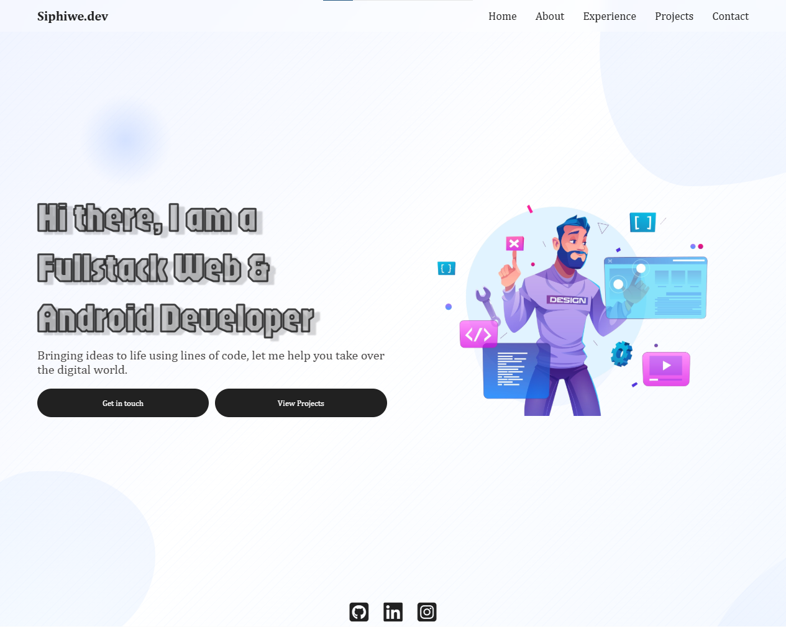

# 🌟 Sibeko Siphiwe's Portfolio | Code • Creativity  

**🚀 Live Demo:** [siphiwe.dev](http://sibeko-siphiwe.free.nf) | **💌 Let's Connect:** [LinkedIn](https://www.linkedin.com/in/siphiwe-sibeko-ba418a312)

---

## 🎨 About This Project

Welcome to my **digital playground**—a fusion of code, design, and way too many caffeine-powered late nights! This repository houses my portfolio website, where I showcase my favorite projects, experiments, and the occasional "why did I think this was a good idea at 2AM?" moments. Built with **love** and **[Tech Stack]**.

 <!-- Add a screenshot later! -->

---

## ✨ Features

- **🌈 Interactive Magic:** Hover animations, smooth transitions, etc (because drama is fun).
- **📂 Project Showcase:** My greatest hits (and hilarious misses) displayed like a tech art gallery.
- **🔧 Built to Tinker:** Modular components, clean code, and a `/weird-experiments` branch I’m too scared to merge.
- **📱 Responsive AF:** Looks great on screens, toasters, and that ancient iPhone 4 in your drawer.

 
