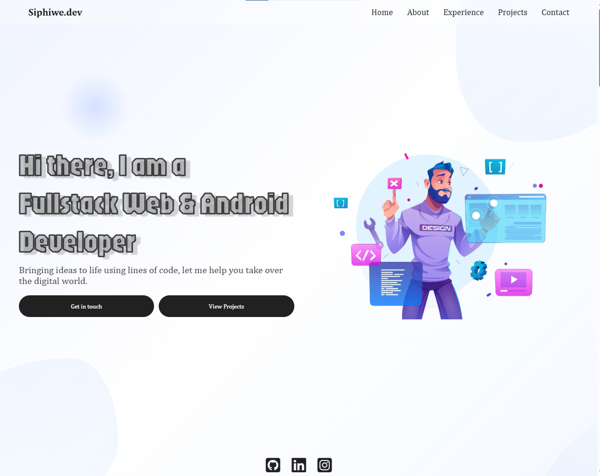

# Sibeko Siphiwe - Professional Portfolio  

**🌐 Live Demo:** [siphiwe.dev](https://sibeko-siphiwe.github.io/.co.za/) | **🤝 Professional Network:** [LinkedIn](https://www.linkedin.com/in/siphiwe-sibeko)

---

## 📋 Project Overview

This repository contains my technical portfolio demonstrating full-stack development capabilities through implemented solutions. Built with modern web technologies, the platform emphasizes:

---

## 🛠️ Core Features

### **⚡ Interactive Experience**
- Context-aware animations   
- State-driven UI transitions 

### **🔧 Technical Implementation**
- Component-driven architecture (Atomic Design)
- Responsive layout system (CSS Grid + Flexbox)
- Accessibility compliance  
- Cross-browser compatibility testing

### **🚀 Deployment & Optimization**
- CI/CD pipeline implementation (GitHub Actions) 
- Lazy loading strategies
- Automated performance audits (Lighthouse CI) 
